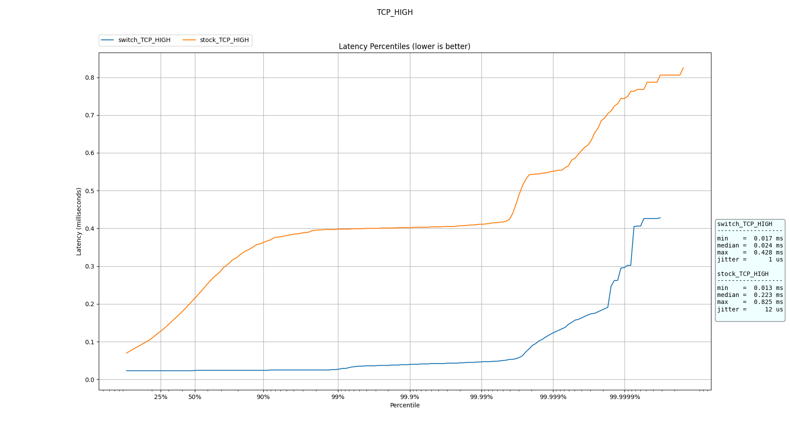

# trex-scripts

Scripts for TRex Python API and a HDR histogram latency plotter with jitter.

The `stl_stats.py` script is used to take latency and jitter measurements.

The `Plotter.py` class is used to parse .json results from the measurements and plot them in a HDR histogram with jitter.

## Traffic

The following 6 traffic-streams is included:

- UDP_LOW: UDP size = 500, @ 1Kpps, 4Mbps
- UDP_HIGH: UDP size = 500, @ 100Kpps, 400Mbps
- TCP_HIGH: TCP size = 500, @ 100Kpps, 400Mbps
- Running MULTIPLE_UDP and MULTIPLE_TCP simultaneously, total of 800Mbps:
    - MULTIPLE_UDP: UDP size = 500, @ 100Kpps
    - MULTIPLE_TCP: TCP size = 500, @ 100Kpps
- BURST_UDP: UDP size = 500 @ 100Kpps with 1 second intervals.
- UDP_SMALL: UDP size = 100 @ 500Kpps, 400Mbps


## Running

### Getting started

#### Install TRex

Follow the steps 0-4 in [README.md](https://github.com/theodorsm/trex-scripts/blob/main/README.md).


#### Environment

Firstly you need to create a configuration file for TRex in `etc/trex_cfg.yaml`:

```yaml
- version: 2
  port_limit: 2
  # ids for your NICs. Can be found by ./dpdk_nic_bind.py -s
  interfaces: ['01:00.0', '01:00.1']
  port_info:
    # MAC for NIC
    - src_mac: '<YOUR NIC1>'
      dest_mac: '<YOUR NIC2>'
    - src_mac: '<YOUR NIC2>'
      dest_mac: '<YOUR NIC1>'
```

Secondly you need to update the `.env` file to correspond to your system.

Then you can install the requirements and activate the virtual environment:
```bash
# Initial setup (once)
python -m venv venv
pip install -r requirements.txt

# Activate (everytime)
source venv/bin/activate
```

### Tweak parameters and run

In `stl_stats.py` you can adjust the following parameters to your needs:

- PPS_LOW (default=1000): Packets per second for UDP_LOW
- PPS_HIGH (default=100000): Packets per second for UDP_HIGH, TCP_HIGH, MULTIPLE and BURST_UDP
- DURATION (default=120): How long each latency measurement should last.
- RUNS (default=4): How many runs of each measurements.
- DUT: The name of device under test. (used to store results)
- IP_SRC: IP of NIC to send traffic
- IP_DST: IP of NIC to receive traffic

To add/remove any of the traffic flows, comment/uncomment the `rx_stats` in main.

To run the script:

```bash
# in one terminal, leave running:
sudo ./t-rex-64 -i --hdrh
# seperate terminal (trex-scripts)
python stl_stats.py
```

To verify and troubleshoot the port setup:

```bash
# with server running
./trex-console

trex> portattr -a
```

## Plotting

### File structure

### Results

The measurements results are stored in json files in the following file structure:

```
results
├── dpdk
│   ├── MULTIPLE_TCP
│   │   ├─ XXXXXXXXXX.json
│   │   ├─ .........
│   ├── MULTIPLE_UDP
│   ├── TCP_HIGH
│   ├── UDP_BURST
│   ├── UDP_HIGH
│   ├── UDP_LOW
│   └── UDP_SMALL
├── dpdk-load
...
├── rt-kernel
....
├── rt-kernel-dpdk
....
├── stock
....
├── stock-load
....
└── switch
....
```

### Out

The plots made is saved in out by DUT:
*You will have to create each DUT directory before the plots are made.*

```
out
├── dpdk
├── dpdk-load
├── nonload
├── rt-kernel
├── rt-kernel-dpdk
├── stock
├── stock-load
├── switch
├── switch_stock
└── CMP_XXXXXX.png

```

### Make plots

In `make_plot.py` you can add all the location of all the result files you want to make plots of in `files`.

You have to add all the DUTs you want to plot in `CONST_DUT`.

`CMP_NAME` is used as a prefix to the comparison plots when the boolean `CMP` is set to True.

Make plots:

```bash
python ./make_plot.py
```

Example comparison plot:

